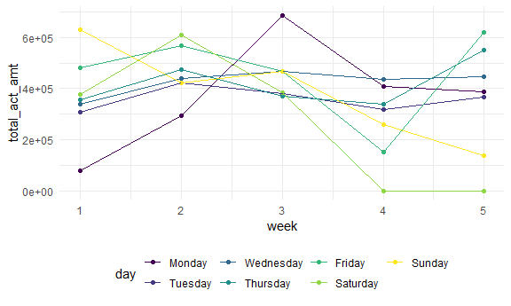
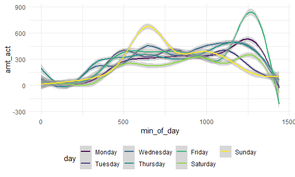

p8105\_hw3\_yl4604
================
Yu
October 6, 2020

Problem 1
---------

``` r
data('instacart')
```

The dataset contains over 3 million online grocery orders information from more than 200,000 Instacart users. The data set has 1384617 rows and 15 columns. The dataset has user/order variables, like user ID, order ID, order day, and order hour. There are also item variables -- name, aisle, department, and some numeric codes.

How many aisles are there, and which aisles are the most items ordered from?

``` r
aisle_df = 
  instacart %>% 
  count(aisle) %>% 
  arrange(desc(n))
```

There are 134 aisles in the dataset, and 'fresh vegetables' is where the most items ordered from.

Make a plot that shows the number of items ordered in each aisle, limiting this to aisles with more than 10000 items ordered. Arrange aisles sensibly, and organize your plot so others can read it.

make a plot!

``` r
aisle_items = 
  instacart %>% 
  group_by(aisle) %>% 
  summarize(n = n()) %>% 
  filter(n > 10000) %>% 
  mutate(
    aisle = factor(aisle),
    aisle = fct_reorder(aisle, n)
  )
```

    ## `summarise()` ungrouping output (override with `.groups` argument)

``` r
ggplot(aisle_items, aes(x = aisle, y = n)) +
geom_point() +
theme(axis.text.x = element_text(angle = 90, vjust = 0.5, hjust = 1))
```


Make a table showing the three most popular items in each of the aisles “baking ingredients”, “dog food care”, and “packaged vegetables fruits”. Include the number of times each item is ordered in your table.

make a table!

``` r
instacart %>% 
  filter(aisle == c('baking ingredients', 'dog food care', 'packaged vegetables fruits')) %>% 
  group_by(aisle,product_name) %>% 
  summarise(n = n()) %>% 
  mutate(rank = min_rank(desc(n))) %>% 
  filter(rank < 4) %>% 
  arrange(aisle, rank) %>% 
  knitr::kable()
```

    ## `summarise()` regrouping output by 'aisle' (override with `.groups` argument)

| aisle                      | product\_name                                   |     n|  rank|
|:---------------------------|:------------------------------------------------|-----:|-----:|
| baking ingredients         | Light Brown Sugar                               |   157|     1|
| baking ingredients         | Pure Baking Soda                                |   140|     2|
| baking ingredients         | Organic Vanilla Extract                         |   122|     3|
| dog food care              | Organix Grain Free Chicken & Vegetable Dog Food |    14|     1|
| dog food care              | Organix Chicken & Brown Rice Recipe             |    13|     2|
| dog food care              | Original Dry Dog                                |     9|     3|
| packaged vegetables fruits | Organic Baby Spinach                            |  3324|     1|
| packaged vegetables fruits | Organic Raspberries                             |  1920|     2|
| packaged vegetables fruits | Organic Blueberries                             |  1692|     3|

Make a table showing the mean hour of the day at which Pink Lady Apples and Coffee Ice Cream are ordered on each day of the week; format this table for human readers (i.e. produce a 2 x 7 table)

make another table!

``` r
instacart %>% 
  filter(product_name == c('Pink Lady Apples', 'Coffee Ice Cream')) %>% 
  group_by(product_name, order_dow) %>% 
  summarize(mean_hr = mean(order_hour_of_day)) %>% 
  pivot_wider(
    names_from = order_dow,
    values_from = mean_hr
  ) %>% 
  knitr::kable()
```

    ## Warning in product_name == c("Pink Lady Apples", "Coffee Ice Cream"): longer
    ## object length is not a multiple of shorter object length

    ## `summarise()` regrouping output by 'product_name' (override with `.groups` argument)

| product\_name    |         0|         1|         2|        3|         4|         5|         6|
|:-----------------|---------:|---------:|---------:|--------:|---------:|---------:|---------:|
| Coffee Ice Cream |  13.22222|  15.00000|  15.33333|  15.4000|  15.16667|  10.33333|  12.35294|
| Pink Lady Apples |  12.25000|  11.67857|  12.00000|  13.9375|  11.90909|  13.86957|  11.55556|

Problem 2
---------

import and tidy the data

``` r
accel_df = 
  read_csv('./data/accel_data.csv') %>% 
  janitor::clean_names() %>% 
  pivot_longer(
    activity_1:activity_1440,
    names_to = 'min_of_day',
    values_to = 'amt_act',
    names_prefix = 'activity_'
  ) %>% 
  mutate(min_of_day = as.numeric(min_of_day)) %>% 
  mutate(weekday_weekend = case_when(
    day == 'Saturday' ~ 'weekend',
    day == 'Sunday' ~ 'weekend',
    TRUE ~ 'weekday'
  ) ) %>% 
  mutate(day = forcats::fct_relevel(day, 'Monday', 'Tuesday', 'Wednesday', 'Thursday', 'Friday', 'Saturday', 'Sunday'))
```

    ## Parsed with column specification:
    ## cols(
    ##   .default = col_double(),
    ##   day = col_character()
    ## )

    ## See spec(...) for full column specifications.

The dataset has variables: week, day\_id, day, min\_of\_day, amt\_act, weekday\_weekend, containing five weeks of the activity counts for each minutes of a 24-hours day of a a 63 year-old male with BMI 25.

Aggregate accross minutes to create a total activity variable for each day, and create a table showing these totals.

``` r
act_amt_df =
  accel_df %>% 
    group_by(week, day) %>% 
    summarise(total_act_amt = sum(amt_act, na.rm = TRUE)) 
```

    ## `summarise()` regrouping output by 'week' (override with `.groups` argument)

``` r
knitr::kable(act_amt_df)
```

|  week| day       |  total\_act\_amt|
|-----:|:----------|----------------:|
|     1| Monday    |         78828.07|
|     1| Tuesday   |        307094.24|
|     1| Wednesday |        340115.01|
|     1| Thursday  |        355923.64|
|     1| Friday    |        480542.62|
|     1| Saturday  |        376254.00|
|     1| Sunday    |        631105.00|
|     2| Monday    |        295431.00|
|     2| Tuesday   |        423245.00|
|     2| Wednesday |        440962.00|
|     2| Thursday  |        474048.00|
|     2| Friday    |        568839.00|
|     2| Saturday  |        607175.00|
|     2| Sunday    |        422018.00|
|     3| Monday    |        685910.00|
|     3| Tuesday   |        381507.00|
|     3| Wednesday |        468869.00|
|     3| Thursday  |        371230.00|
|     3| Friday    |        467420.00|
|     3| Saturday  |        382928.00|
|     3| Sunday    |        467052.00|
|     4| Monday    |        409450.00|
|     4| Tuesday   |        319568.00|
|     4| Wednesday |        434460.00|
|     4| Thursday  |        340291.00|
|     4| Friday    |        154049.00|
|     4| Saturday  |          1440.00|
|     4| Sunday    |        260617.00|
|     5| Monday    |        389080.00|
|     5| Tuesday   |        367824.00|
|     5| Wednesday |        445366.00|
|     5| Thursday  |        549658.00|
|     5| Friday    |        620860.00|
|     5| Saturday  |          1440.00|
|     5| Sunday    |        138421.00|

``` r
ggplot(act_amt_df, aes(x = week, y = total_act_amt, fill = day)) +
geom_point() +
geom_violin()
```



???trends?

Make a plot

``` r
accel_df %>%
  ggplot(aes(x = min_of_day, y = amt_act, color = day)) +
  geom_point() +
  geom_line(alpha = .5)
```



???
